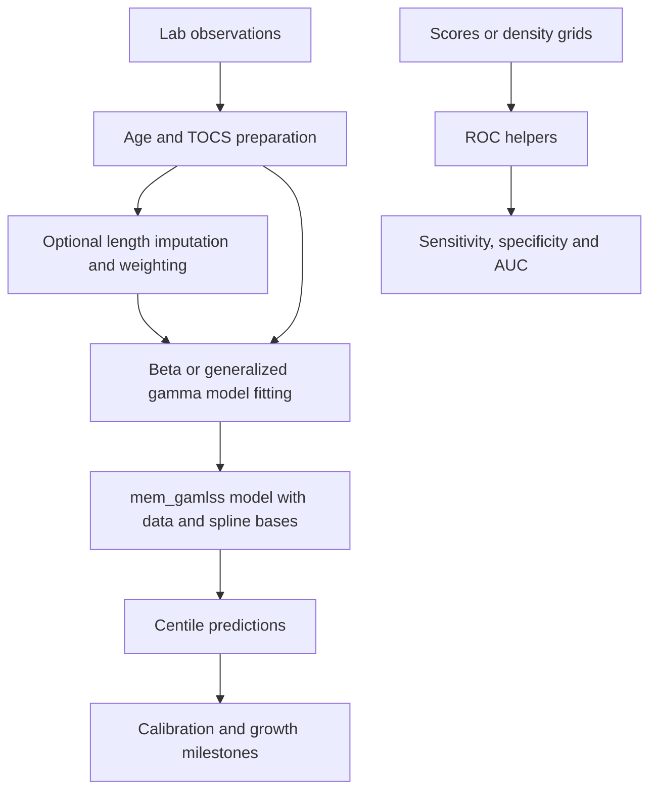

# Study wisclabmisc

Date: 2026-09-29. Package version: 0.1.1.9000. Reviewed HEAD: cbf7e71.

## Scope and work items

Study the package for future development chats; record architecture, conventions,
and a test baseline. This is familiarization, not a full correctness review.

- [x] Inspect metadata, exports, source modules, data inventory, and documentation.
- [x] Trace modeling, ROC, imputation, and utility workflows.
- [x] Finish the existing test suite and record results.
- [x] Finalize this package map.

## Decisions and tracking convention

- User selected inst/agents for chat/task records.
- Use new-work for dated notes (YYYY-MM-DD_short-kebab-slug.md), with active notes
  in pending/ and completed notes in done/.
- Use working-on to keep a task note current and resume it in later chats.
- Do not commit a new tracking note automatically (working-on skill).
- Preserve existing untracked scratch files and article model artifacts.
- No package implementation changes are part of this study.

## Package purpose and layout

wisclabmisc standardizes code reused across WISC Lab speech research projects.
It combines analysis helpers, data preparation and reference data, filesystem and
database utilities, and reproducible publication supplements.

- R/: 19 source files; flat functional organization rather than a central pipeline.
- NAMESPACE: generated exports, print methods for audit and brm_args, dplyr and
  tidy-evaluation imports, and the re-exported magrittr pipe.
- man/: generated roxygen documentation; R/data.R documents eight bundled datasets.
- data/: fake rate/intelligibility data, simulated intelligibility by utterance
  length, consonant/vowel features and acquisition data, and TOCS items.
- data-raw/: preparation scripts and input files; excluded from package builds.
- tests/testthat/: edition 3 tests, mostly utilities and ROC calculations.
- vignettes/: GAMLSS and ROC guides. vignettes/articles/: longer workflows and
  publication supplements, excluded from package builds but included in the site.
- inst/: assorted auxiliary scripts and scratch artifacts, plus these task notes.
- README.md is generated from README.Rmd.
- _pkgdown.yml organizes reference sections through roxygen concepts.
- .github/workflows/pkgdown.yaml builds the site on pushes/PRs to main/master,
  releases, and manual runs; deploys non-PR builds to gh-pages.

## Component map

| Area | Source | Main entry points and behavior |
| --- | --- | --- |
| GAMLSS foundation | R/gamlss-centiles.R | mem_gamlss retains training data, session information and original call in .user; generic centile prediction, reshaping, and calibration helpers |
| Intelligibility growth | R/model-intelligibility.R | fit_beta_gamlss fits beta location/scale models using natural splines; predict_beta_gamlss reconstructs predictions from saved bases; root and slope helpers find milestones |
| Speaking rate | R/model-rate.R | fit_gen_gamma_gamlss models mu, sigma and nu with natural splines; predict_gen_gamma_gamlss uses saved bases and distribution quantiles |
| Resampling | R/resampling.R | join_to_split expands sampled IDs into observation rows while preserving bootstrap multiplicity; optional validation |
| Staged imputation | R/impute-staged.R | impute_values_by_length reshapes long to wide, fits sequential linear models, fills missing values using earlier lengths, then returns long data and imputation labels |
| Length weighting | R/impute-staged.R | weight_lengths_with_ordinal_model fits ordinal::clm to longest attained length versus a spline of x, then turns category probabilities into cumulative reach probabilities and normalized weights |
| ROC | R/roc.R | compute_empirical_roc and compute_smooth_density_roc wrap pROC and return tidy coordinates, AUC, direction, and optimal-cutoff flags; compute_sens_spec_from_ecdf supports observation weights and requires explicit direction |
| Other statistics | R/predictive-value.R, R/utils-stats.R | Predictive values from rates; entropy, cross entropy and KL divergence; logit-normal mean and root-finding helper |
| Clustering | R/clustering.R | fit_kmeans scales selected columns, fits k-means, and adds original-scale cluster means, ranks, and a principal-component-based ordering to input rows |
| Model argument defaults | R/brms.R | brms_args_create returns a closure merging defaults with per-call overrides, including adapt_delta normalization; produces argument lists rather than fitting models |
| Database | R/database.R | tbl_bind selects database tables with tidyselect and lazily unions them, optionally adding source labels; print_duckdb is internal |
| Files | R/utils-files.R | Rename and sync functions separate action planning from execution and default to dry runs; rename detects collisions/chains; sync can compare metadata, MD5, or xxhash and optionally remove destination extras |
| Audit and programming | R/utils-programming.R | audit_wrap creates data-plus-notes objects; peek logs without replacing data, poke logs and replaces it; skip_block reports unevaluated code |
| Lab data helpers | R/utils.R | Age formatting/parsing and chronological age, TOCS filename decoding, interval intersection-over-union |
| Validation | R/utils-type-checks.R | Internal numeric and whole-number assertions used by age utilities; bounds, missingness, infinity and vector/scalar policies |

## Main data flows

The diagram describes composable user workflows; the package does not automatically
run these stages. Generic predict_centiles delegates to gamlss::centiles.pred;
specialized predictors use stored spline bases and coefficients directly.
The *_se fitting wrappers accept variable names for programmatic/parallel use.

## Development conventions

- DESCRIPTION requires R >= 4.2 and declares testthat edition 3.
- Existing code mixes base and magrittr pipes and qualified/unqualified dplyr calls.
  Prefer base pipes for new code per r-package-development.
- Many public APIs use tidy evaluation for bare column names and tidyselect.
- Roxygen is the source of public help and NAMESPACE; re-document after changes.
- NEWS.md records user-facing changes. Add public topics to the pkgdown index,
  often through the existing @concept categories.
- Relevant skills: r-package-development, testing-r-packages, cli, lifecycle;
  cran-extrachecks and create-release-checklist for release work.
- Default local checks: devtools::test(); devtools::check() for broader package
  validation; pkgdown::check_pkgdown() for reference coverage.

## Observations to retain

- Model objects deliberately retain data and spline bases, which is central to
  portable prediction and later milestone calculations.
- check_sample_centiles is a defunct compatibility entry point implemented with
  lifecycle::deprecate_stop; check_model_centiles is its replacement.
- Existing tests emphasize ROC behavior, age/TOCS helpers, audit objects, numeric
  validation, file operations, database binding, and information measures.
  No dedicated fitting/imputation/clustering/resampling test files were found;
  test-centiles.R tests computed-centile calibration, not fitted models.
- The only workflow found is pkgdown; no separate R CMD check workflow was found.
- .Rbuildignore currently has no inst/agents exclusion. Task notes under inst/
  would normally enter built packages. Record this for a future packaging decision;
  this study does not change build configuration.
- Existing untracked files at study start: data-raw/kfpool.txt, inst/a.html,
  inst/gamlss2.R, inst/kf.R, inst/scratch.Rmd, inst/str-frame.R, inst/t.R, and
  vignettes/articles/models/.

## Verification

devtools::test(reporter = "summary") completed with exit code 0 under R 4.6.0: no test failures, and two intentionally skipped file-operation demos (test-utils-files.R). R emitted startup
locale warnings for LC_COLLATE, LC_CTYPE, LC_MONETARY, and LC_TIME (C.UTF-8).
Full R CMD check, site builds, and publication-model execution are outside this
initial study and have not been run.

